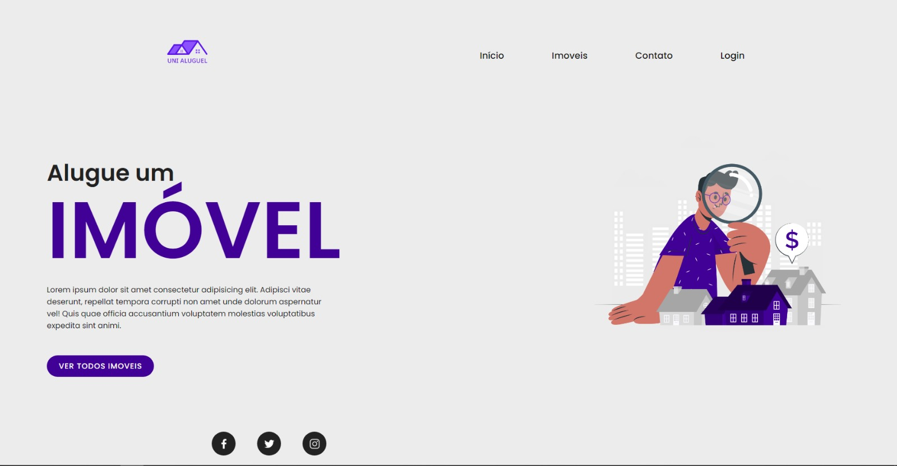
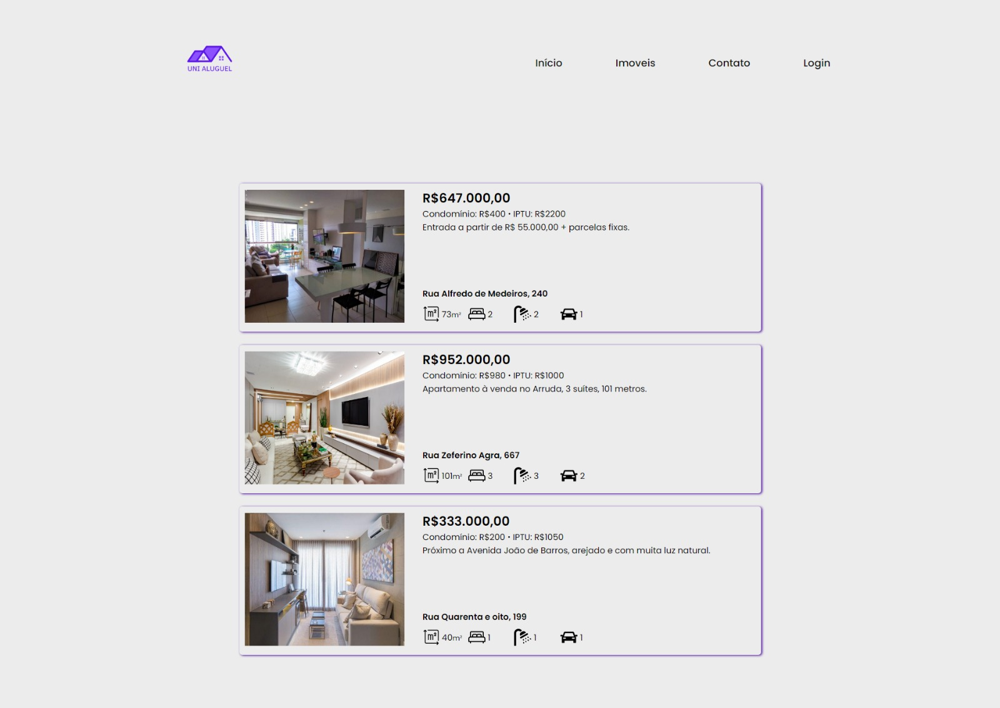
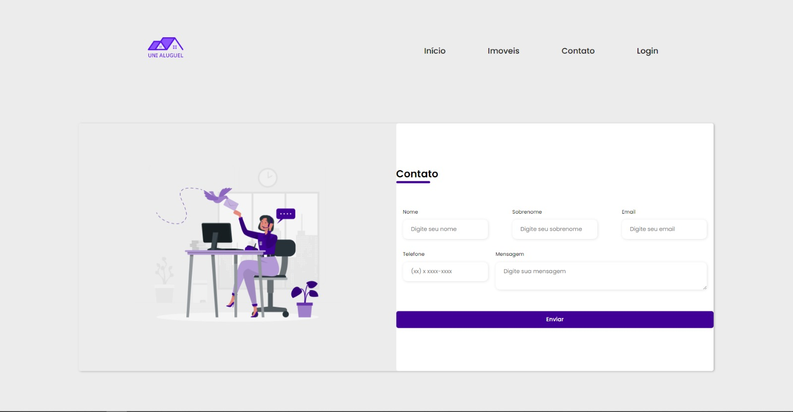
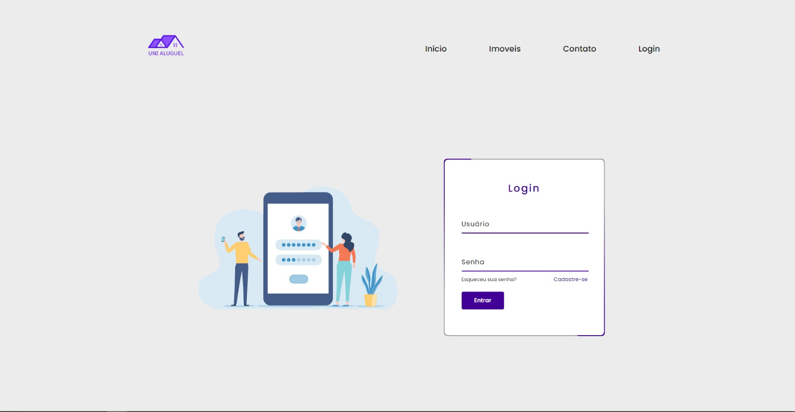
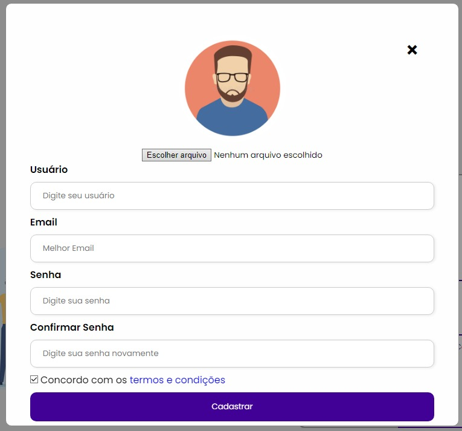
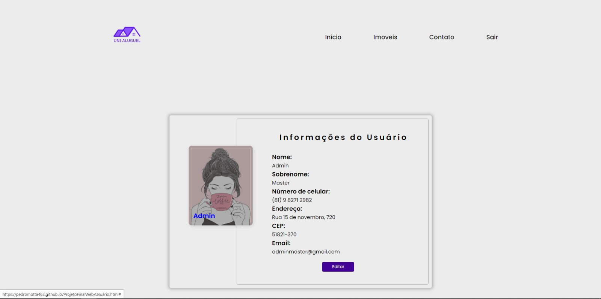

 # Projeto Final 
Cada equipe da turma NSIN é contratada pelo porto digital para implementar os produtos que desenvolveram durante a residência. Porém, é exigido que uma versão inicial seja enviada para melhor avaliação. Logo, cada equipe deve implementar as interfaces criadas e enviadas para o professor da cadeira de Introdução à programação Web. As instruções para a entrega estão descritas a seguir. 
 # - 1. Organização do Projeto 
 - a. O projeto precisa estar bem estruturado com páginas exclusivas para imagens, css e javascript 
 - b. As páginas precisam estar funcionais, ou seja, todos os caminhos de links e interações precisam levar para um destino 
 - 2. Requisitos do projeto 
 - a. As páginas devem ser geradas pelas equipes, não por frameworks 
 - b. Deve haver pelo menos 4 páginas html, com arquivos css que atendam a necessidade de cada página. Provavelmente é mais organizado e saudável para o ambiente ter mais de um arquivo css 
 - c. Caso não haja 4 páginas nas telas enviadas, criem novas páginas que façam sentido para o produto 
 - d. Caso seu produto seja um app, adapte para uma versão web. 
 - e. O design não precisa ser o mais lindo do mundo, o que importa é que seja funcional!!!!! 
 # - 3. Pontos obrigatórios 
 - a. O projeto tem que conter: 
 - i. Imagem ou logo nas telas 
 - ii. Imagens no corpo html () 
 - iii. Troca de páginas através de hiperlink (<a href=...>) 
 - iv. Um perfil do usuário (Não precisa implementar um banco de dados ou todas as interações, pode ser um perfil fake) 
 - v. Formulário com campos diversos e separados por (Texto ou senha ou telefone ou …) 
 - vi. No mínimo uma função javascript 
 # - 4. Entrega: 
 - a. Entregar no dia 23/11.22 
 - b. Compactar toda a pasta com o nome do projeto. Exemplo: projeto.zip c. No classroom, mandar o arquivo compactado e listar os integrantes da equipe na atividade que será criada apenas para entrega (SÓ UM INTEGRANTE DA EQUIPE ENVIA O ARQUIVO).  

 
## Screenshots
 - Homepage

 - Imoveis

 - Contato

 - Login

 - Cadastro

 - Usuário

